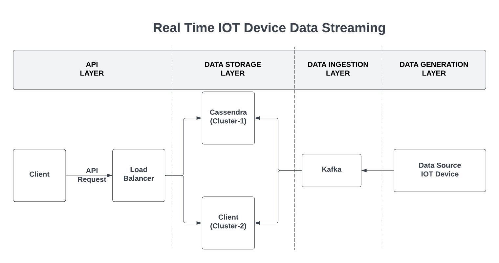

# DDS-512- Real time IOT Data Streaming

A project demonstrating integration between Cassandra, Kafka, and Flask for managing IoT data streams from Apple devices.

---
## System-Diagram IOT-System-Diagram.jpeg


## Requirements

- **Python 3.10** (via [Conda](https://docs.conda.io/projects/conda/en/latest/user-guide/install/index.html))
- **Docker** and **Docker Compose**

---

## Installation and Setup

### Step 1: Clone the Repository
```bash
git clone <repository-url>
cd <repository-folder>
```

### Step 2: Create and Activate Conda Environment
```bash
conda create -n dds python=3.10
conda activate dds
```

### Step 3: Install Python Dependencies
```bash
pip install pandas numpy faker kafka-python cassandra-driver flask
```

### Step 4: Start Docker Containers
```bash
docker-compose up -d
```

This will start the Cassandra and Kafka services as defined in the `docker-compose.yml` file.

### Step 5: Run Cassandra and Kafka Setup Script
```bash
python cassandra_kafka_setup.py
```

This script initializes the Cassandra database with necessary keyspaces and tables and sets up Kafka topics.

### Step 6: Stream IoT Data to a Specific Table
Use the `data-stream-id.py` script to stream mock IoT data to Cassandra tables. For example:
```bash
python data-stream-id.py
```

### Step 7: Start the Flask Application
Run the Flask server to expose an API for interacting with the IoT data:
```bash
flask --app iot_apple run
```

The server will start on `http://127.0.0.1:5000`.

---

## Usage
1. Ensure all services (Cassandra, Kafka, Flask) are running.
2. Interact with the API via the Flask endpoints to retrieve or manage IoT data stored in Cassandra.

---

## Project Structure
- **`docker-compose.yml`**: Defines the Docker environment for Cassandra and Kafka.
- **`cassandra_kafka_setup.py`**: Sets up Cassandra tables and Kafka topics.
- **`apple_stream.py`**: Simulates IoT data streams into Cassandra via Kafka.
- **`iot_apple`**: Flask application exposing APIs for the IoT data.

---

## Troubleshooting
- **Docker Issues**: Ensure Docker is running and the ports (`9042`, `9092`) are not blocked by other processes.
- **Cassandra Errors**: Check the initialization script and verify the Cassandra container logs for errors.
- **Kafka Errors**: Verify Kafka topics are correctly configured and Zookeeper is running.

---
